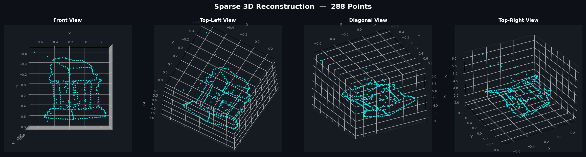
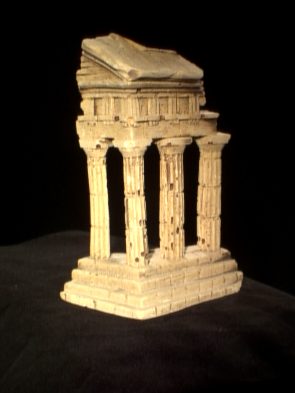
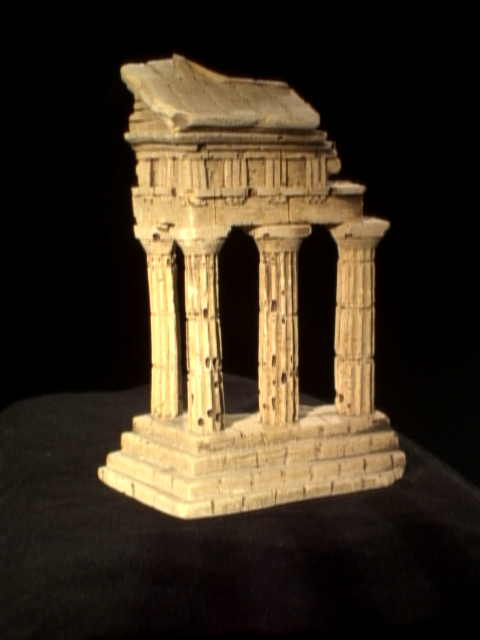

# Sparse 3D Reconstruction from Stereo Images

A **pure NumPy implementation** of a multi-view stereo pipeline that reconstructs 3D point clouds from two calibrated 2D images — built from scratch without any deep learning or 3D reconstruction libraries.

The entire pipeline is implemented using only the mathematical foundations: **Singular Value Decomposition (SVD)**, **Epipolar Geometry**, **Triangulation**, and **Non-linear Optimization**.

---

## Result

The reconstructed 3D sparse point cloud of the temple (288 points) visualized from four angles:



Input stereo pair used for reconstruction:

| Image 1 | Image 2 |
|---|---|
|  |  |

---

## Pipeline Overview

```
Input Images + Calibration
        │
        ▼
┌─────────────────────────┐
│  1. Eight-Point Algorithm│  →  Fundamental Matrix F (3×3)
│     (SVD + Refinement)  │
└─────────────────────────┘
        │
        ▼
┌─────────────────────────┐
│  2. Epipolar Search     │  →  Matching pts2 for given pts1
│     (Gaussian Window    │
│      Similarity)        │
└─────────────────────────┘
        │
        ▼
┌─────────────────────────┐
│  3. Essential Matrix    │  →  E = K2ᵀ · F · K1
└─────────────────────────┘
        │
        ▼
┌─────────────────────────┐
│  4. Camera Pose         │  →  4 candidate extrinsic matrices
│     (SVD Decomposition) │     select correct one via positive depth
└─────────────────────────┘
        │
        ▼
┌─────────────────────────┐
│  5. Triangulation       │  →  3D Points (N×3)
│     (AX = 0, SVD)       │
└─────────────────────────┘
        │
        ▼
     3D Point Cloud + Reprojection Error
```

---

## Project Structure

```
Sparse_Reconstruction_Project/
├── python/
│   ├── submission.py          # Core algorithms (8-point, epipolar, triangulation)
│   ├── helper.py              # Utility functions (refineF, camera2, display tools)
│   └── test_temple_coords.py  # Main pipeline script — run this
│
├── data/
│   ├── im1.png                # Left stereo image
│   ├── im2.png                # Right stereo image
│   ├── some_corresp.npz       # Known point correspondences (pts1, pts2)
│   ├── temple_coords.npz      # Target points in im1 to triangulate
│   └── intrinsics.npz         # Camera calibration matrices (K1, K2)
│
├── docs/
│   └── reconstruction_result.png
│
├── requirements.txt
├── .gitignore
└── README.md
```

---

## Algorithms Implemented

### 1. Eight-Point Algorithm
Estimates the **Fundamental Matrix F** from N ≥ 8 point correspondences.
- Normalizes coordinates by scale factor `M = max(width, height)`.
- Constructs the design matrix `A` (N×9) and solves via **SVD**.
- Enforces the **rank-2 singularity constraint** on F.
- Refines F using **Powell's non-linear optimization** to minimize the Sampson error.

### 2. Epipolar Correspondences
For each target point `(x1, y1)` in image 1:
- Computes the corresponding **epipolar line** in image 2 using `l = F · p1`.
- Slides a **21×21 Gaussian-weighted window** along the epipolar line.
- Returns the pixel with minimum weighted L2 patch distance.

### 3. Essential Matrix
$$E = K_2^T \cdot F \cdot K_1$$

### 4. Camera Pose Recovery
Decomposes `E` via SVD to produce **4 candidate** extrinsic matrices `[R|t]`.  
Selects the correct one by requiring all triangulated points to have **positive depth (Z > 0)** in front of both cameras.

### 5. Triangulation
For each point pair `(x1,y1)`, `(x2,y2)`, forms the linear system:

$$A \cdot X = 0, \quad A \in \mathbb{R}^{4 \times 4}$$

Solves for the 3D coordinate `X` as the **last right-singular vector** of A.

---

## Getting Started

### Prerequisites
- Python 3.9+
- pip

### Installation

```bash
git clone https://github.com/YOUR_USERNAME/sparse-3d-reconstruction.git
cd sparse-3d-reconstruction
pip install -r requirements.txt
```

### Run on Default Temple Dataset

```bash
cd python
python test_temple_coords.py
```

**Expected output:**
```
Fundamental Matrix F:
[[ 9.78e-10 -1.32e-07  1.12e-03] ...]

Finding epipolar correspondences for the target coordinates...

Essential Matrix E:
[[ 2.26e-03 -3.06e-01  1.66e+00] ...]

Candidate 0: 228/288 points with positive depth.
Candidate 1:  60/288 points with positive depth.
Candidate 2: 288/288 points with positive depth.  ← Selected
Candidate 3:   0/288 points with positive depth.

Reprojection Error: 1.8275
Plot saved to ../results_custom_reconstruction.png
```

### Run on Your Own Custom Dataset

```bash
cd python
python test_temple_coords.py \
    --im1 ../data/my_left.png \
    --im2 ../data/my_right.png \
    --corresp ../data/my_corresp.npz \
    --coords ../data/my_target_pts.npz \
    --intrinsics ../data/my_intrinsics.npz
```

| Argument | Description | Required Keys in .npz |
|---|---|---|
| `--im1` | Path to left image | — |
| `--im2` | Path to right image | — |
| `--corresp` | Known point correspondences | `pts1`, `pts2` |
| `--coords` | Target points to triangulate in im1 | `pts1` or `x1`+`y1` |
| `--intrinsics` | Camera calibration matrices | `K1`, `K2` |

---

## Results

| Metric | Value |
|---|---|
| Number of 3D Points | 288 |
| Reprojection Error | **1.83 pixels** |
| Points with Positive Depth | **288 / 288 (100%)** |

> The assignment target was a reprojection error **< 2 pixels**. ✅

---

## How to Prepare Your Own Data

If you want to run this on **your own images**, you need three things:

**1. Camera Intrinsics (`K1`, `K2`)**
Use OpenCV's checkerboard calibration to find your camera's focal length and optical center. Save as `intrinsics.npz`.

**2. Point Correspondences (`some_corresp.npz`)**
Use SIFT/ORB in OpenCV to automatically extract and match features between your two images.
```python
import cv2, numpy as np
img1 = cv2.imread('im1.png', cv2.IMREAD_GRAYSCALE)
img2 = cv2.imread('im2.png', cv2.IMREAD_GRAYSCALE)
sift = cv2.SIFT_create()
kp1, des1 = sift.detectAndCompute(img1, None)
kp2, des2 = sift.detectAndCompute(img2, None)
bf = cv2.BFMatcher()
matches = bf.knnMatch(des1, des2, k=2)
good = [m for m,n in matches if m.distance < 0.75*n.distance]
pts1 = np.float32([kp1[m.queryIdx].pt for m in good])
pts2 = np.float32([kp2[m.trainIdx].pt for m in good])
np.savez('some_corresp.npz', pts1=pts1, pts2=pts2)
```

**3. Target Points (`temple_coords.npz`)**
Pick any feature-rich points from image 1 to reconstruct into 3D. You can use a Harris corner detector or manually pick them.

---

## Tech Stack

| Library | Purpose |
|---|---|
| `NumPy` | Matrix operations, SVD |
| `SciPy` | Non-linear optimization (`fmin_powell`) |
| `Matplotlib` | 3D visualization |

---

## License

This project is open-source and available under the [MIT License](LICENSE).
